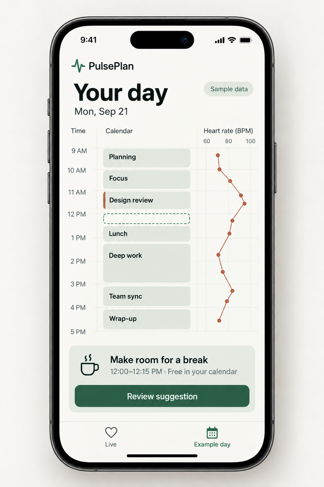
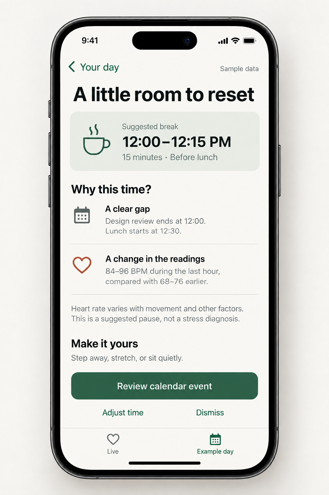

# LowCor

### Your calendar knows when you’re busy. Your body knows when you need a pause.

A hackathon-built iPhone app that brings health signals, on-device AI, and your calendar together—so a packed workday can make room for a reset.

[](https://github.com/alexnguyen25/chatathon/actions/workflows/ci.yml)
**SwiftUI · HealthKit · EventKit · Apple Foundation Models**

## The idea

Back-to-back meetings make it easy to ignore how you’re feeling. Calendar apps show when you’re free, but an empty slot alone doesn’t mean you need a break.

LowCor starts with your recorded health data. When it finds a sustained rise in heart rate compared with earlier in the day, it explains the observation, suggests a calm pause, and finds room for it in your schedule. You review the suggestion and decide whether to add it.

**Health signals first. Calendar placement second. You make the call.**

## What we built

- **Today:** a health check-in, what’s happening now, and one clear next action.
- **Your day:** a meeting-heavy schedule with a suggested break placed right after a meeting—not one minute later.
- **Health:** heart-rate readings, HRV, resting heart rate, sleep context, and explanations of what each metric means.
- **On-device AI:** Apple Foundation Models chooses a constrained pause type, with a labeled fallback when the model isn’t available.
- **Calendar integration:** review and confirm a break before saving it to a calendar you choose.
- **A ready-to-run demo:** fictional health readings and a busy workday, with no account, backend, or API key required.

## Where AI fits

Swift computes the health observations and checks for a sustained heart-rate rise using an experimental rule. Only then does on-device AI choose a calm pause, such as a quiet reset or time away from the screen. Calendar logic finds an available slot.

The model does **not** invent measurements, diagnose stress, or create calendar events on its own. Explanations use computed observations; every real calendar write requires your confirmation.

See the [health-signal rule](docs/health-signal-rule.md) for the exact MVP behavior.

## Try the demo in a minute

The demo opens at **11:55 AM**: a fictional corporate workday with **15 calendar events**, an exaggerated heart-rate rise, and a meeting ending at noon.

1. Explore **Health** to see the readings and **Your day** to see the schedule.
2. On **Today**, tap **Analyze my signals**.
3. Read the explanation, then tap **Review break**.
4. Confirm the **12:00–12:15** break with **Add to demo day**.
5. Tap **See it in my day** to find it in the agenda.

Use **Reset** to replay the scenario. Demo data stays inside LowCor and never writes to Apple Health or your real calendar.

[Full demo walkthrough →](docs/DEMO.md)

## Design

A calm, mobile-first interface built around three destinations: Today, Your day, and Health.

These are our **design mockups**, not screenshots of every current app state:

<table>
  <tr>
    <td></td>
    <td></td>
  </tr>
</table>

[Design references and tokens →](docs/design/lowcor-core/README.md)

## Run locally

**Requirements:** Xcode 26+ and an iOS 26+ simulator or iPhone.

1. Open [`ios/LowCor.xcodeproj`](ios/LowCor.xcodeproj).
2. Select the **LowCor** scheme and your device or simulator.
3. For an iPhone, select your development team in **Signing & Capabilities** and change the bundle identifier if needed.
4. Build and run. Demo mode works without Health or Calendar permissions.

On-device AI requires a device where Apple Foundation Models is available. The labeled fallback keeps the demo usable without it.

### Connect real data

Exit demo mode and connect Health and Calendar separately. LowCor can read available heart rate, HRV (SDNN), resting heart rate, and sleep records through HealthKit.

Real breaks are saved only after review and confirmation. Calendar entries omit physiological readings and AI explanations; their visibility follows the selected calendar’s sharing settings.

**The AirPods angle:** optional live heart-rate collection uses HealthKit and compatible sensor hardware. It starts and saves an “Other” workout, which may affect activity metrics. This MVP does not provide passive, continuous, all-day AirPods monitoring, and a simulator cannot validate sensor streaming.

## Development

Run the core regression tests and compile the simulator target:

```sh
DEVELOPER_DIR=/Applications/Xcode.app/Contents/Developer bash scripts/check.sh
```

The test suite covers the app’s actual core logic: health-pattern checks, missing data, calendar boundaries, overlapping meetings, sleep aggregation, and supporting observations. Hardware, model availability, and real permission flows require device testing.

| Location | What’s inside |
| --- | --- |
| [`ios/LowCor`](ios/LowCor) | The active SwiftUI app and integrations |
| [`ios/LowCor/Core`](ios/LowCor/Core) | Shared health-analysis and scheduling logic |
| [`Tests/LowCorCoreTests`](Tests/LowCorCoreTests) | Core regression tests |
| [`docs`](docs/README.md) | Demo guide, design assets, and implementation notes |
| [`archive`](archive/README.md) | Earlier hackathon prototypes, preserved for reference |

## Built for a hackathon, not a diagnosis

LowCor is an experimental MVP, not a medical device. Heart rate can change for many reasons; the app cannot diagnose stress or prove a meeting caused a physiological change. Its pattern rule is not clinically validated, and missing data or no suggestion does not establish wellbeing.

Suggestions are optional context—not instructions to trust blindly. Use your own judgment and seek appropriate medical care for concerning symptoms. Reliable background monitoring and App Store readiness are outside this prototype’s scope.
