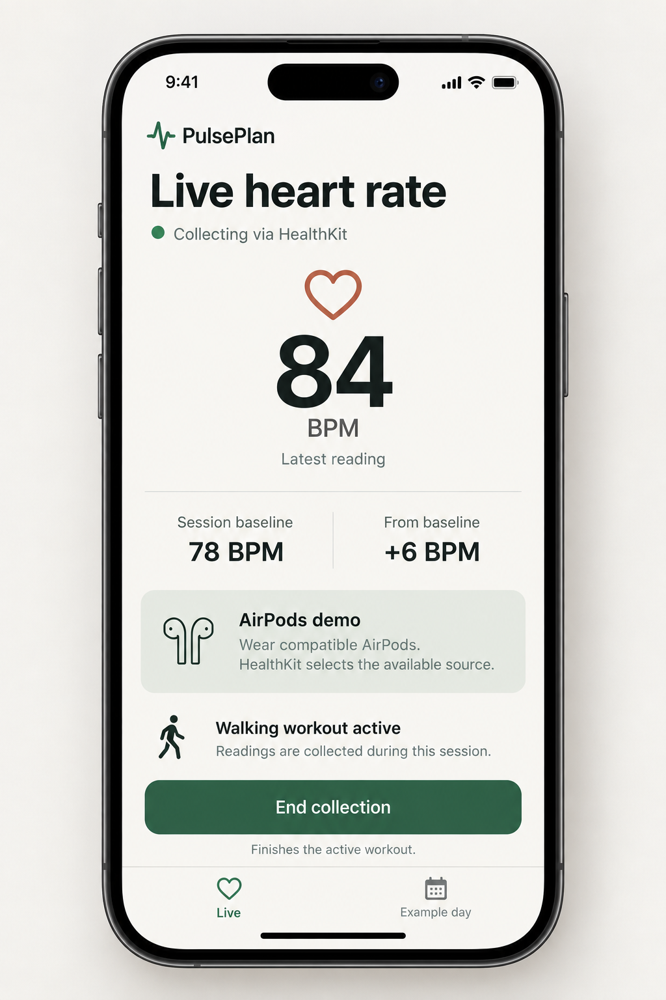
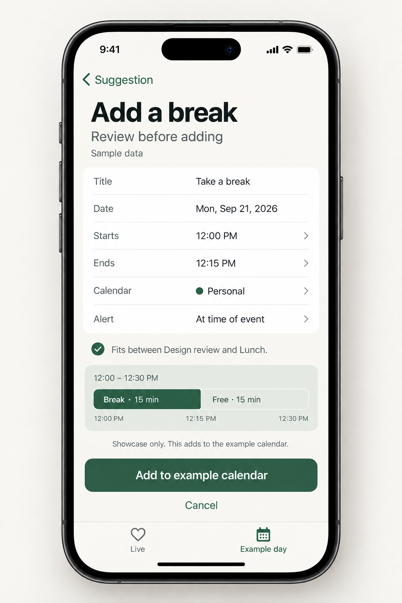
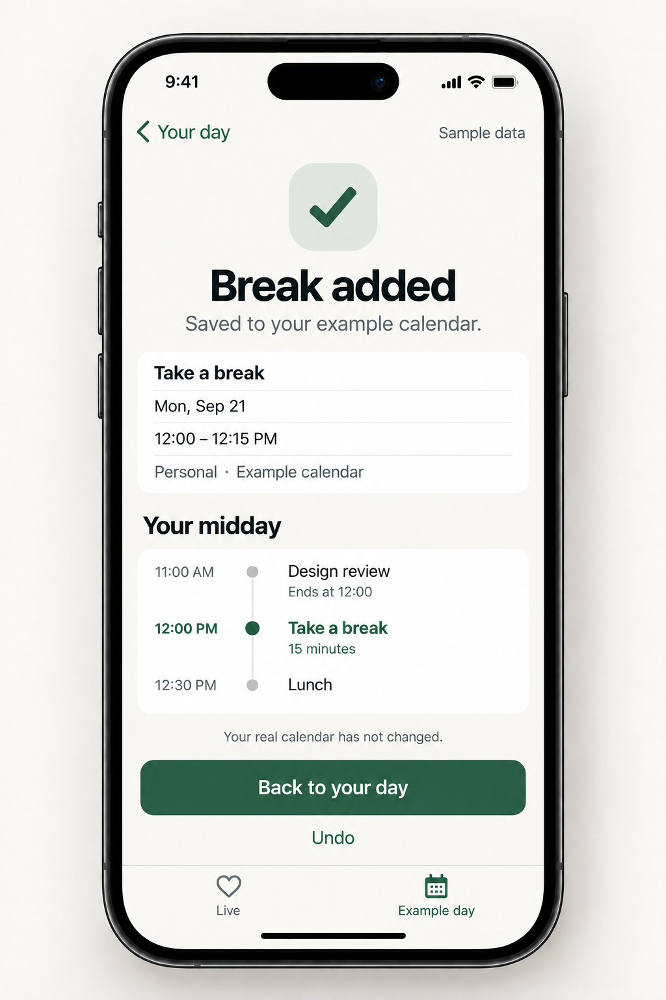

# PulsePlan — core iPhone concept

Four core screens and one completion state. Designed September 19, 2026.

**Collect heart rate → see it alongside a calendar → suggest a break → review and add it.**

This is a visual concept, not a working app or evidence of a live device test. All numbers in the images are illustrative. The app's Live tab is intended to show real incoming HealthKit readings; Example day is a separate, explicitly synthetic demonstration.

## Screens

| Screen | Purpose | Primary action |
| --- | --- | --- |
| [01 · Live collection](01-live-collection.png) | Make the real-data collection demonstration legible. | End collection while active; Start collection while idle. |
| [02 · Example day](02-example-day.png) | Align calendar and heart-rate context across a full working day. | Review suggestion. |
| [03 · Break suggestion](03-break-suggestion.png) | Explain the free time slot and the observed change in readings. | Review calendar event; alternatives Adjust time and Dismiss. |
| [04 · Calendar review](04-calendar-review.png) | Preview the exact title, date, times, destination and alert. | Add to example calendar. |
| [04b · Confirmation](04b-calendar-confirmation.png) | Show the new break between its neighboring events. | Back to your day; Undo. |

### 01 · Live collection

### 02 · Full-day showcase

### 03 · Break suggestion

### 04 · Calendar event review

### 04b · Completion state

## Short demo flow

1. Open **Live**. With Health authorization requested, tap **Start collection**. Explain inline that this starts a walking workout. Show a dash while waiting for a reading.
2. When readings arrive, display current BPM. After three readings, show their mean as the session baseline and the current difference. The baseline is a session reference, not a resting-heart-rate estimate or medical normal.
3. Tap **End collection**. Show Finishing until the session ends. Then switch to **Example day**.
4. The sample day shows calendar blocks and heart-rate values against the same vertical time axis. Explain the graph once: time runs down; BPM increases to the right. This keeps the two sources aligned without squeezing two unrelated charts above each other.
5. Tap **Review suggestion**. The example proposes a 12:00–12:15 break after Design review and before Lunch. The rationale cites both the free gap and a change in readings, without saying the meeting caused stress.
6. Tap **Review calendar event**. Edit the start/end or destination if desired. **Adjust time** on the suggestion opens this same review with the time control focused.
7. Tap **Add to example calendar**. The confirmation shows the inserted break. **Back to your day** returns to the timeline with a solid green event. **Undo** removes only the newly added example event.

The sample insertion is a safe, self-contained showcase. A future real-calendar version uses the same review, names the actual writable calendar, and changes the action to **Add to calendar**. Success is shown only after a confirmed save; it must not silently promote a sample event into a real calendar.

## Sample day

Monday, September 21, 2026; local device time.

| Time | Calendar |
| --- | --- |
| 09:00–10:00 | Planning |
| 10:00–11:00 | Focus |
| 11:00–12:00 | Design review |
| 12:00–12:30 | Available |
| 12:30–13:00 | Lunch |
| 13:00–15:00 | Deep work |
| 15:00–16:00 | Team sync |
| 16:00–17:00 | Wrap-up |

The dashed outline in the day mockup represents the **available 30-minute gap**. The suggestion uses its first 15 minutes; event review shows the other 15 minutes remaining free. The final saved break must occupy 12:00–12:15 only.

Example rationale: readings of 84–96 BPM in the 11:00–12:00 window compared with 68–76 in an earlier window. These are fictional observations, not thresholds, a validated model, or a personalized health recommendation. The full-day image is a showcase overview; future suggestions operating at noon must not use readings from later in that day.

Heart-rate chart lines are a visual guide between illustrative samples, not a continuous ECG. In an implementation, do not bridge missing-data intervals. Tapping an observation should expose its timestamp and BPM; provide an equivalent readable list.

## Interaction states

| State | Design behavior |
| --- | --- |
| Health access not requested | Show Allow Health access. Explain the active walking workout requirement beside Start collection. |
| Idle / ended | Replace End collection with Start collection. Do not label an old value as current. |
| Waiting for readings | Show “— BPM” and “Waiting for a heart-rate reading.” No fabricated value or zero. |
| Baseline pending | Show “Collecting initial readings”; reveal baseline after three received samples. |
| Data unavailable / no samples | Explain that no readings are available; keep Example day usable. Do not infer Health read denial from an empty result. |
| Stopping / failure | Use Finishing until completion; show failures honestly and allow retry after cleanup. |
| Calendar not connected | Offer Connect calendar when entering real calendar context; showcase remains available separately. |
| Empty calendar | Show available time with “No events today”; do not fabricate a busy schedule. |
| Missing heart-rate interval | Leave a visible chart gap with “No readings”; offer schedule-based breaks without inventing a physiological rationale. |
| Adjusted break conflicts | Show the overlap inline and require a different time; never move existing events automatically. |
| Add in progress / failed | Disable duplicate submissions while saving; retain the draft and show retry on failure. Never show success early. |
| Dismiss / cancel | Return to the day without inserting an event. |
| Confirmation / undo | Confirm the exact saved destination and times. Undo removes that inserted event only. |

## Essential design tokens

Machine-readable values: [tokens.json](tokens.json).

| Element | Specification |
| --- | --- |
| Canvas / surface | Warm ivory #F6F5F0 / white #FFFFFF |
| Primary / secondary text | Charcoal #202C28 / muted gray-green #58635C |
| Actions / supporting surfaces | Forest #245C46 / pale sage #E5ECE3 |
| Heart-rate data | Terracotta #A55442; informational, never a stress severity code |
| Type | Native system font; 32 pt title, 22 pt section, 17 pt body, 15 pt secondary, 88 pt primary BPM |
| Spacing | 4 / 8 / 12 / 16 / 24 / 32 / 48 pt; 24 pt content inset |
| Shape | 16 pt surface radius; 14 pt button radius |
| Controls | 54 pt primary buttons; minimum 44 pt hit areas |
| Navigation | Two stable destinations: Live and Example day; back navigation for suggestion and review |
| Motion | Immediate press feedback; short interruptible transitions; no decorative pulsing or animated ECG |

Allow Dynamic Type to grow the layout and scroll content. Keep the primary action clear without covering content or the home indicator. At larger text sizes, use a selected-time agenda with corresponding BPM values rather than shrinking the two-column timeline.

Use text and symbols as well as color for collecting, suggested, available and saved states. Give every chart value and event an accessible label. Read out heart-rate updates on demand rather than continuously interrupting VoiceOver. Respect Reduce Motion with fades or static changes.

## What exists versus what is proposed

Inspected current README, ContentView.swift and CalendarStore.swift in this checkout.

- **Present in code:** HealthKit authorization request; walking workout start/end; latest BPM; first-three-reading baseline and delta; calendar permission request and today's titles/start times.
- **Not verified here:** physical AirPods streaming or sensor provenance. The UI says “Collecting via HealthKit,” not “AirPods connected.” Hardware attribution needs actual evidence.
- **Proposed in this concept:** tab layout, aligned full-day visualization, synthetic showcase data, suggestion rationale, editable break drafts, conflict checks, calendar insertion and undo.
- **Relevant data gap:** the current calendar view model retains start times but not end times. Accurate availability and conflict detection require event end times.
- **Relevant data gap:** current live readings are stored as bare BPM values for baseline calculation. The timeline needs timestamped readings and explicit missing-data handling.
- No background or all-day AirPods capture is promised by these screens. The full day is explicitly sample data.

The previous MVP document excluded scheduling recommendations and design polish. This concept follows the user's newer request and does not rewrite that older plan or change production code.

## Review and delivery checks

- Inspected all five generated images: consistent phone framing, color, navigation and typography; readable key numbers and actions; no cropped screen edges.
- Verified sample labels on the day, suggestion, review and confirmation screens.
- Verified the same 12:00–12:15 proposal and 12:30 lunch across the flow; the dashed day block is availability, not the saved event's duration.
- Verified the active Live screen exposes End collection and explains the workout. Idle and waiting behavior is specified above.
- Verified suggestion copy allows other explanations for heart-rate changes and makes no stress diagnosis.
- Verified review precedes save; confirmation identifies the example calendar and offers Undo.
- Files are saved in this directory. No production source was changed and no real calendar event was created.
- Raster mockups illustrate layout; accessibility, live-device behavior and actual calendar saves still require implementation and runtime validation.

Generated with the built-in image-generation tool using the mobile screen-design and Apple design skills. Exact prompts: [generation-prompts.md](generation-prompts.md).
